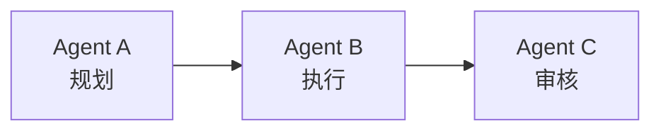
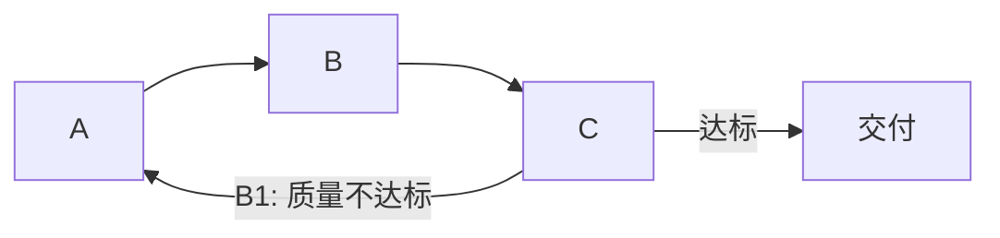
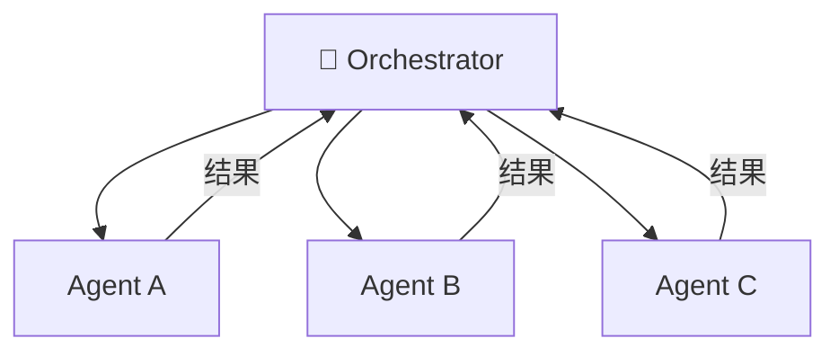
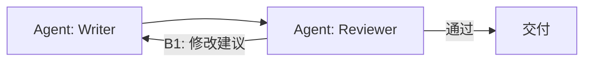
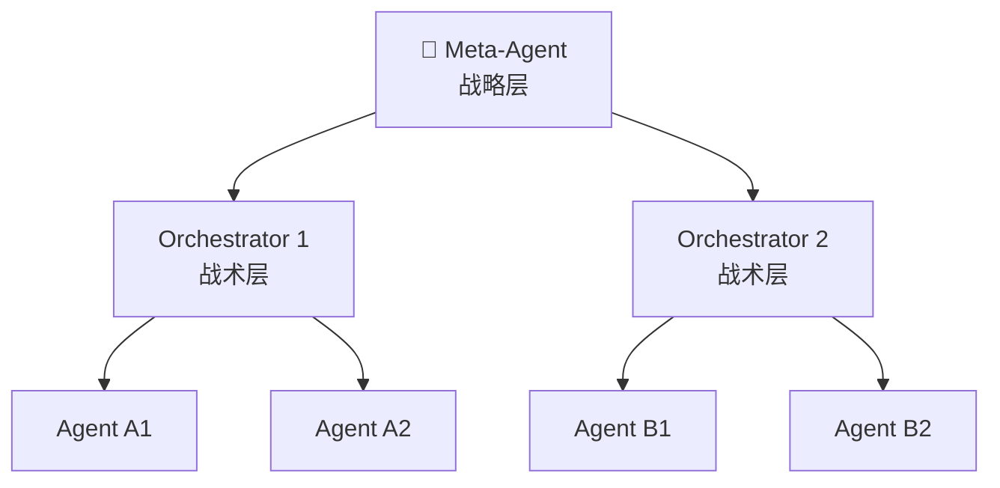
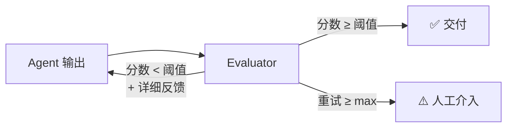
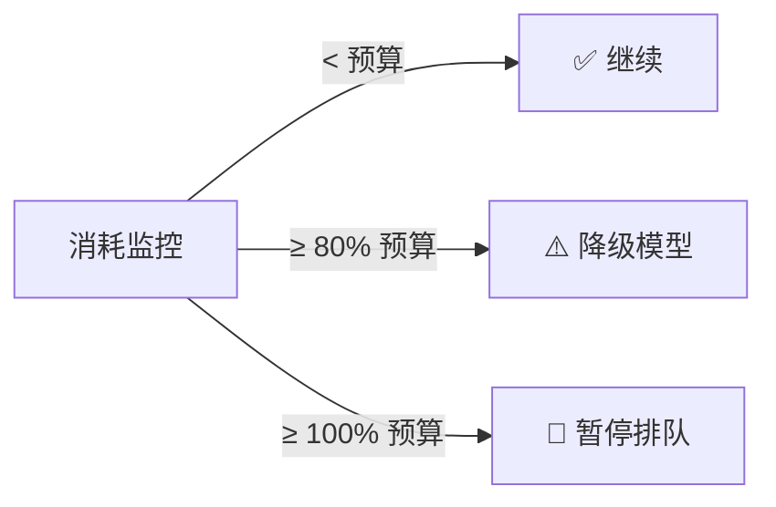
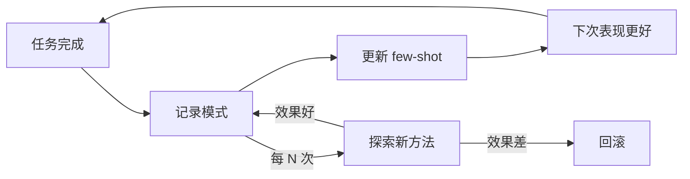
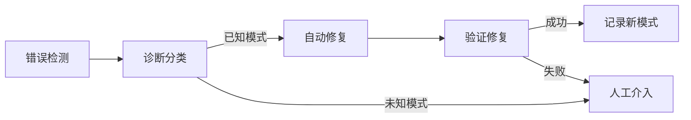
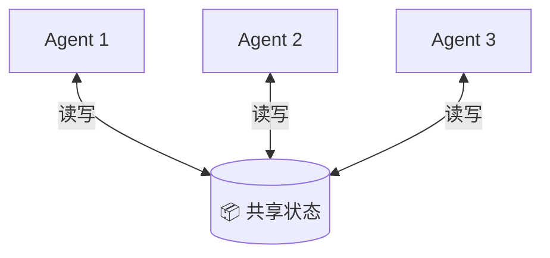

# AI Harness 设计模式库

> harness-architect 在 Phase 3（Harness 设计）时参考此文件，选择合适的编排模式。

---

## 一、Agent 编排模式

### 1.1 链式（Chain）

**适用**：明确的线性流程，步骤间有严格先后顺序
**回路**：单一调节回路（审核 → 反馈回起点）
**优点**：简单、可预测、易调试
**风险**：一环出错全链断；不适合需要并行的场景

**AI Harness 实例**：
- 写代码 → 跑测试 → 审代码 → 合并
- 收集数据 → 分析 → 生成报告 → 人工审核

**回路设计**：

---

### 1.2 星形（Hub-Spoke）

**适用**：复杂任务需要分解为多个独立子任务
**回路**：中心调节回路（Orchestrator 评估所有结果）+ 分支增强回路
**优点**：并行执行效率高；Orchestrator 有全局视野
**风险**：Orchestrator 成瓶颈（单点故障 + 延迟）

**AI Harness 实例**：
- 多维度分析：Orchestrator 分发"分析市场"、"分析技术"、"分析财务"，汇总结果
- 代码重构：分发文件级任务，汇总后检查一致性

**调节回路**：
- B1: Orchestrator 验证结果一致性
- B2: 每个 Spoke Agent 内部自检

---

### 1.3 评审对（Reviewer Pair）

**适用**：质量要求高，需要多视角审核
**回路**：双调节回路（Writer 自查 + Reviewer 外审）
**优点**：有效对抗"合成谬误"（局部理性 ≠ 全局最优）
**风险**：循环可能不收敛（互相否定）

**设计要点**：
1. **必须设 max_retries**（通常 3 次）
2. **Reviewer 不只说"不好"，要说"哪里不好、为什么、建议怎么改"**
3. **两者的评判标准必须对齐**（避免标准冲突导致死循环）

**AI Harness 实例**：
- Agent A 写代码 + Agent B 审代码（OpenAI Codex 实验的做法）
- Agent A 写文章 + Agent B 从读者视角审阅

---

### 1.4 分层（Hierarchical）

**适用**：大型系统，需要多层抽象
**回路**：多层调节 + 局部增强
**优点**：可扩展性好；每层只管自己的复杂度
**风险**：层间延迟大；信息在层间可能失真

**设计要点**：
1. **每层有自己的调节回路**，不能只依赖最顶层
2. **信息向上聚合、向下分解**，不能跳层
3. **每层的目标必须与上层对齐**

---

### 1.5 混合（Hybrid）

实际系统通常是多种模式的组合。

**设计原则**：
1. 核心流程用**链式**（保证顺序）
2. 可并行的子任务用**星形**（提高效率）
3. 关键输出用**评审对**（保证质量）
4. 整体编排用**分层**（管理复杂度）

---

## 二、反馈回路模板

### 2.1 质量调节回路（B-Quality）

**参数**（可编辑）：
| 参数 | 默认值 | 说明 |
|------|--------|------|
| quality_threshold | 0.8 | 质量分阈值（0-1） |
| max_retries | 3 | 最大重试次数 |
| feedback_detail | high | 反馈粒度：high/medium/low |
| escalation_target | human | 超限后升级给谁 |

---

### 2.2 资源调节回路（B-Resource）

**参数**（可编辑）：
| 参数 | 默认值 | 说明 |
|------|--------|------|
| token_budget | 100000 | 单任务 token 预算 |
| warning_threshold | 0.8 | 预警水位线 |
| downgrade_model | haiku | 降级使用的模型 |
| queue_timeout | 300s | 排队超时时间 |

---

### 2.3 学习增强回路（R-Learn）

**参数**（可编辑）：
| 参数 | 默认值 | 说明 |
|------|--------|------|
| exploration_rate | 0.1 | 10% 的任务尝试新方法 |
| pattern_retention | 30d | 模式保留时间 |
| min_samples | 5 | 模式至少需要多少样本才纳入 |

---

### 2.4 自修复回路（B-SelfHeal）

---

## 三、信息流模式

### 3.1 共享状态（Shared State）

所有 Agent 读写同一个状态存储。

**适用**：Agent 需要知道彼此进度/结果
**风险**：并发冲突、数据污染
**实现**：JSON 文件 / Redis / 数据库

### 3.2 消息传递（Message Passing）

Agent 通过消息队列异步通信。

**适用**：松耦合的 Agent，不需要实时知道对方状态
**优点**：解耦好、可扩展
**风险**：消息丢失、顺序问题

### 3.3 黑板模式（Blackboard）

所有 Agent 向一个"黑板"写入自己的发现，其他 Agent 从黑板读取。

**适用**：需要多 Agent 协作解决开放性问题
**优点**：灵活、支持渐进式问题求解
**风险**：黑板成为瓶颈

---

## 四、可观测性模板

### 必须暴露的指标

| 类别 | 指标 | 说明 |
|------|------|------|
| **存量** | queue_depth | 任务队列深度 |
| **存量** | context_usage_pct | Context 窗口使用百分比 |
| **存量** | error_count | 累计错误数 |
| **流量** | throughput | 单位时间处理任务数 |
| **流量** | token_rate | Token 消耗速率 |
| **流量** | success_rate | 任务成功率 |
| **延迟** | feedback_latency | 反馈回路延迟 |
| **延迟** | e2e_latency | 端到端延迟 |

---

## 五、垃圾回收模板

| 熵增来源 | 清理策略 | 频率 |
|---------|---------|------|
| Context 污染 | 定期压缩/重置 | 每 N 轮对话 |
| 过时 few-shot | 审计有效性，删除过时模式 | 每周 |
| 残留中间状态 | 超时自动清理 | 实时 |
| 日志膨胀 | 归档旧日志 | 每天 |
| 缓存陈旧 | TTL 自动过期 | 按配置 |
