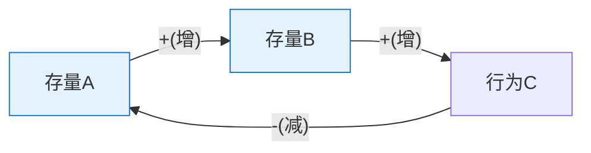
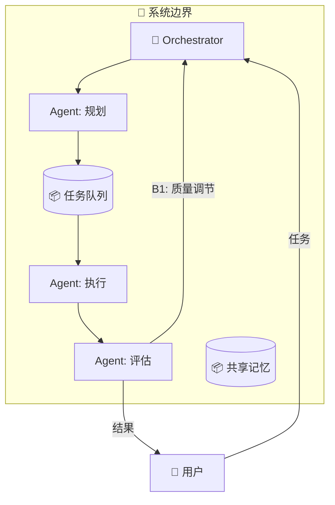
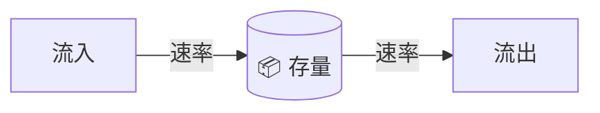

# 系统论知识包 — Harness Architect 参考手册

> 本文件是 harness-architect skill 的核心知识库。AI 在 Phase 2（系统分析）时参考此文件。

---

## 一、存量与流量模型

### 核心定义

- **存量（Stock）**：系统中某一时刻可观察和测量的累积量——系统的"记忆"和"惯性"来源
- **流量（Flow）**：改变存量的速率，分为流入（inflow）和流出（outflow）
- **存量变化 = 流入 - 流出**

### AI Harness 中的典型存量

| 存量 | 流入 | 流出 | 管理策略 |
|------|------|------|---------|
| **任务队列** | 新任务到达 | Agent 处理完成 | 优先级排序 + 并发控制 |
| **Context 窗口占用** | 新信息注入 | 旧信息被截断/遗忘 | 渐进式披露 + 定期压缩 |
| **知识库内容** | 新内容写入 | 过时内容清理 | 垃圾回收机制 |
| **错误累计** | 新错误产生 | 错误修复 | 质量调节回路 |
| **用户信任度** | 好的交付体验 | 错误/延迟 | 可观测性 + 透明沟通 |
| **Token 预算** | 预算补充/周期重置 | API 调用消耗 | 资源调节回路 |
| **Agent 经验库** | 新的成功/失败模式 | 过时模式清理 | 学习增强回路 |

### 关键洞察

1. **存量有缓冲作用**：即使流入突然为零，存量不会立即归零（这就是为什么有"知识储备"概念）
2. **人的直觉擅长感知存量，不擅长感知流量变化率**：用户能说"任务太多了"，但不容易说"任务增长速度在加快"
3. **改变存量需要时间**：不能瞬间清空技术债，也不能瞬间建立用户信任

---

## 二、反馈回路

### 增强回路（Reinforcing Loop / R）

放大变化方向，导致指数增长或指数衰退。"滚雪球效应"。

#### AI Harness 中的增强回路

| 名称 | 增长型 | 衰退型 |
|------|--------|--------|
| **质量飞轮** | 好输出 → 用户信任 → 更多使用 → 更多数据 → 更好输出 | 差输出 → 信任崩塌 → 不用 → 没反馈 → 更差 |
| **知识积累** | 有效笔记 → 更好的 context → AI 输出更准 → 更多使用 → 更多笔记 | — |
| **技术债** | 赶工 → 技术债增加 → 开发变慢 → 更赶工 → 更多技术债 | — |
| **Agent 专精** | 某 Agent 被频繁使用 → 获得更多反馈 → 优化更好 → 更被频繁使用 | 其他 Agent 没机会 → 不优化 → 更不被用 |

### 调节回路（Balancing Loop / B）

对抗变化、维持稳定。"恒温器效应"。每个调节回路都有一个**目标值**。

#### AI Harness 中的调节回路

| 名称 | 目标 | 检测 | 纠正 |
|------|------|------|------|
| **质量门** | 输出质量分 ≥ 阈值 | Evaluator Agent 打分 | 反馈修正，max N 次 |
| **成本控制** | Token 消耗 ≤ 预算 | 消耗监控 | 降级模型/压缩 context |
| **负载均衡** | 队列长度 ≤ 阈值 | 队列深度监控 | 增加并发/降低接入 |
| **架构守卫** | 代码符合规范 | Linter/CI | 拒绝合并 + 反馈 |
| **反幻觉** | 事实准确率 ≥ 阈值 | Fact-check Agent | 标注不确定 + 引用源 |

### 回路分析技巧

1. **识别主导回路**：同一时间，系统行为由当前占主导的回路决定。增长期 R 主导；触顶后 B 接管
2. **回路中 `-` 的数量为奇数 = 调节回路**；为偶数 = 增强回路
3. **所有调节回路都需要有目标值**，否则它不知道要调节到哪里
4. **给调节回路设 max retries**，否则可能死循环

---

## 三、延迟

### 三种延迟

| 类型 | 定义 | AI 系统举例 |
|------|------|------------|
| **感知延迟** | 问题发生但还没察觉 | Agent 输出质量下降，但没有监控告警 |
| **响应延迟** | 察觉了但决策需时间 | 发现问题后需要人工审批才能调整 |
| **交付延迟** | 决策了但执行需时间 | 决定加新 Agent，但开发/测试要一周 |

### 延迟的后果

- **振荡（Oscillation）**：洗澡调水温效应——反馈太慢 → 过度纠正 → 反向过冲 → 反复
- **过冲与崩溃**：增长超过承载力，但调节回路的延迟导致来不及刹车

### 减少延迟的策略

| 策略 | 对应延迟类型 | 实现 |
|------|-------------|------|
| **实时监控** | 感知延迟 | 每步 Agent 输出都有指标暴露 |
| **自动化决策** | 响应延迟 | 质量低于阈值自动回退，不需人审批 |
| **渐进式交付** | 交付延迟 | 先上最小可用版本，再迭代优化 |
| **单步反馈** | 所有类型 | Agent 每执行一步就检查，不等到最后 |

---

## 四、12 个杠杆点（从低效到高效）

> 来源：Donella Meadows, "Leverage Points: Places to Intervene in a System", 1999

| # | 杠杆点 | 人话 | 效力 | AI Harness 举例 |
|---|--------|------|------|----------------|
| 12 | 常数、参数、数字 | 调旋钮 | ★☆☆☆☆ | 调 temperature、max_tokens、timeout |
| 11 | 缓冲区大小 | 加库存 | ★☆☆☆☆ | 增大 context window、加消息队列 |
| 10 | 存量-流量的物理结构 | 改管道 | ★★☆☆☆ | 重构 Agent 间的数据管道 |
| 9 | 延迟 | 缩短等待 | ★★☆☆☆ | 加实时测试、减少审批环节 |
| 8 | 调节回路的强度 | 加刹车 | ★★★☆☆ | 加 CI/CD 门禁、质量评估 Agent |
| 7 | 增强回路的增益 | 控油门 | ★★★☆☆ | 限制 Agent 并发数、遏制技术债累积 |
| 6 | 信息流结构 | 让该看到的人看到 | ★★★★☆ | Agent 间共享状态、让用户看到 Agent 思考过程 |
| 5 | 规则 | 改游戏规则 | ★★★★☆ | 修改代码审查规则、架构约束、Linter 配置 |
| 4 | 自组织能力 | 让系统自己进化 | ★★★★☆ | Agent 自己决定"需要谁帮忙"、动态编排 |
| 3 | 系统目标 | 改方向盘指向 | ★★★★★ | 从"输出更多"改为"输出更准"、重新定义成功标准 |
| 2 | 范式 | 改世界观 | ★★★★★ | 从"AI 是工具"到"AI 是系统中的 Agent" |
| 1 | 超越范式 | 所有范式都可变 | ★★★★★ | 认识到系统设计本身就是可迭代的假设 |

### 使用指南

1. **从高处往低处看**：先问"目标对吗？"再问"结构对吗？"最后才问"参数对吗？"
2. **常见陷阱**：90% 的人直觉上先调参数（#12），但这恰恰效力最低
3. **性价比最高**：在 AI 系统中，信息流结构（#6）和规则（#5）是性价比最高的干预点
4. **组合使用**：不同层级的杠杆点可以组合——比如"改规则（#5）+ 缩短延迟（#9）"

---

## 五、六大系统基模

### 5.1 饮鸩止渴（Fixes That Fail）

**结构**：一个调节回路（快速修复）+ 一个延迟的增强回路（副作用）

```
问题症状 ──[快速修复]──→ 症状缓解
                ↓ (延迟副作用)
           问题加重 ──→ 回到更严重的起点
```

**AI 检测信号**：
- 同一类问题反复出现，每次修复后短暂好转
- 修复手段越来越极端（prompt 越来越长、约束越来越多）
- 团队说"又要 workaround 了"

**AI Harness 实例**：
- Agent 输出差 → 加更多 prompt 约束 → context 溢出 → 质量更差
- 系统慢 → 加缓存 → 一致性问题 → 诡异 bug → 排查时间更长

**干预**：
1. 给快速修复加时间限制（"这个 workaround 只用 2 周"）
2. 同时启动根本解的开发
3. 监控副作用指标

---

### 5.2 舍本逐末（Shifting the Burden）

**结构**：两个调节回路竞争——治标方案（短期见效）vs 治本方案（长期有效但慢）

```
问题 ──┬──[治标]──→ 缓解 → 依赖增加 → 治本能力萎缩
       └──[治本]──→ [被忽视]
```

**AI 检测信号**：
- 有一个"万能人/万能 Agent"所有问题都找它
- 根本方案一直"排期中"但从不启动
- 一旦万能方案失效，全线崩溃

**AI Harness 实例**：
- 幻觉问题 → 加 fact-check Agent（治标） → 不投入数据清洗（治本）
- 靠一个人审所有 Agent 输出 → 不建自动化测试 → 人一离开就崩

**干预**：
1. 有意识地投入根本解，即使短期效果更慢
2. 给治标方案设退出标准
3. 度量治本能力（如自动化覆盖率）

---

### 5.3 增长极限（Limits to Growth）

**结构**：增强回路（驱动增长）被调节回路（限制因素）拉住

```
增强回路 R（初期主导）: 投入 → 产出 → 更多投入
调节回路 B（延迟显现）: 产出增大 → 限制因素凸显 → 产出受阻
```

**AI 检测信号**：
- 初期效果很好，但收益曲线开始变平
- 继续加大投入（更多 Agent、更大模型）但效果不再显著
- 团队说"已经到极限了"

**AI Harness 实例**：
- Agent 越加越多 → 通信开销 O(n²) → 协调成本吃掉收益
- 给 prompt 加越来越多规则 → context 占用太多 → 真正有效的信息被挤出

**干预**：
1. **不是踩更猛的油门，而是松开刹车** — 识别并消除限制因素
2. 在增长回路还在上升时就预判限制因素
3. 可能需要结构性重组而非量的增加

---

### 5.4 富者愈富（Success to the Successful）

**结构**：两个竞争者共享有限资源，初始优势导致资源倾斜

```
A 初始优势 → 更多资源 → 表现更好 → 更更多资源
B 初始劣势 → 资源被挤 → 表现更差 → 进一步边缘化
```

**AI 检测信号**：
- 某个 Agent/方案被过度依赖，其他被废弃
- 没有给弱方案改善的机会
- "赢者通吃"的资源分配

**AI Harness 实例**：
- 表现好的 Agent 被优先分配任务 → 更多训练数据 → 其他 Agent 永远得不到改善
- 某个 prompt 模板效果好 → 所有场景都套用 → 忽视了场景差异

**干预**：
1. 设计资源分配的公平性机制（轮训、AB 测试）
2. 给弱 Agent 分配探索任务
3. 定期评估"是否真的应该一直用这个？"

---

### 5.5 公地悲剧（Tragedy of the Commons）

**结构**：多个个体共享有限资源，每个都最大化自己的使用

```
个体 A 理性最大化 ──┐
个体 B 理性最大化 ──┤──→ 共享资源耗尽 → 所有人受损
个体 C 理性最大化 ──┘
```

**AI 检测信号**：
- 多 Agent 争抢同一资源
- 没有配额管理
- 偶发"突然全停了"

**AI Harness 实例**：
- 多 Agent 共享 API 配额 → 每个都尽量多用 → 配额耗尽 → 全停
- 多 Agent 共享 context → 每个都塞信息 → context 溢出

**干预**：
1. 引入配额管理（每 Agent 独立预算）
2. 使用量透明化（让每个 Agent "看到"自己用了多少）
3. 或干脆给每个 Agent 独立资源池

---

### 5.6 军备竞赛（Escalation）

**结构**：双方通过增强回路不断升级对抗

```
A 升级 → B 感到威胁 → B 升级 → A 感到威胁 → A 进一步升级
```

**AI 检测信号**：
- 输出越来越长/复杂/详细，但并不是真的需要
- 两个 Agent/系统在"比着来"
- 成本螺旋上升

**AI Harness 实例**：
- Agent A 为了"赢"输出更长 → Agent B 也输出更长 → token 成本飙升
- 安全攻防：攻击和防御手段不断升级

**干预**：
1. 设置输出上限约束
2. 引入外部仲裁机制
3. 重新定义"赢"的标准（不是更多，而是更准）

---

## 六、系统边界

### 画边界的原则

1. **包含所有对关心行为有显著影响的反馈回路**
2. **排除对行为影响微弱的因素**（减少复杂性）
3. **边界不是固定的** — 随着理解加深可以调整

### 常见错误

| 错误 | 表现 | 后果 |
|------|------|------|
| 边界太窄 | 只看 Agent 本身，忽略人、数据、基础设施 | 遗漏关键回路 |
| 边界太宽 | 把市场、竞争、政策都纳入 | 模型过于复杂，无法操作 |
| 边界不一致 | 分析时一个边界，设计时另一个 | 分析和设计脱节 |

---

## 七、Mermaid 可视化规范

### 因果回路图（CLD）



**规则**：
- `+` = 同向变化（A 增 → B 增，A 减 → B 减）
- `-` = 反向变化（A 增 → B 减）
- 回路标注用注释：`%% R1: 增强回路 — 飞轮效应`
- 存量用方框 `[名称]`，外部因素用圆括号 `(名称)`

### Agent 架构图



**规则**：
- Agent 用方框 + emoji 标注角色
- 存量用圆柱体 `[("名称")]`
- 反馈回路用标签标注类型
- 人类节点在边界外
- 菱形节点 `{"决策点"}` 表示人类检查点

### 存量-流量图


